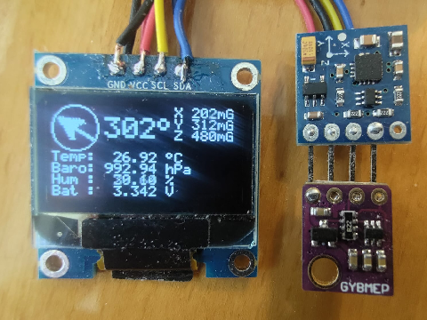

# ATtiny85 Sonic Screwdriver: A Bare-Metal Masterclass

   



> **"It's like fitting a cathedral inside a shoebox."**

This project is a fully functional "Sonic Screwdriver" prop powered by a single **ATtiny85** microcontroller. It features a 128x64 OLED display, a real-time compass, environmental sensors, synthesized audio, and a pulsing LED core.

**The Catch?** It runs on a chip with only **8KB of Flash** (Code) and **512 Bytes of RAM** (Memory). To make this possible, standard libraries were abandoned in favor of "Bare Metal" C++ drivers, integer mathematics, and hardware multiplexing.

---

# 🔬 So… What Makes This Tiny Project Special?

This runs on the ATtiny85 — essentially a microscopic computer. It has:

*   **8 KB** of storage
*   **512 bytes** of working memory
*   **Two** hardware timers
*   **No** operating system
*   **No** graphics engine
*   **No** sound engine
*   **No** libraries

And yet, it behaves like a complex multi-system device. That’s the impressive part.

### 1. The Screen: Drawing Without Remembering

Normally, a device builds a full image in memory before sending it to the display. That alone would require **more RAM than this chip even has**.

Instead of storing the screen, the image is generated in real time — each tiny chunk of pixels is calculated and immediately transmitted. The chip never “remembers” the whole image. Computation and transmission occur simultaneously.

**And the Font…**
A normal font library cannot be used — they are far too large. Every character (A–Z, numbers, symbols) is encoded as raw bits — tiny grids of on/off pixels stored compactly in program memory. There is no text engine. No font renderer. Only raw bitmaps and careful memory placement.

### 2. The Graphics: Inverse Texture Mapping

To draw the rotating compass, standard computers use a "Frame Buffer" (memory of the screen). Pixel positions are calculated and written into that buffer.

**The Problem:** There is no frame buffer. The screen cannot be randomly written to; it can only be streamed linearly.

**The Solution:**

Instead of rotating the needle onto the screen (Forward Mapping), the code iterates through the *screen's* physical pixels and calculates mathematically backwards to determine which part of the needle belongs at that position.

*   **The Math:** `u = x*cos(θ) + y*sin(θ)` (calculated using fixed-point integers).
*   **The Result:** The rotated image is generated byte-by-byte and sent directly to the I2C bus.
*   **The Benefit:** Zero RAM buffer required. No visual artifacts (“holes”) in the image.

This technique is typically found in 3D game engines and is implemented here on an 8-bit microcontroller to overcome strict memory limits.

### 3. The Math: Reinventing Trigonometry

Rotating the compass needle requires sine and cosine.

**The Problem:**
1.  **No FPU:** The chip has no Floating Point Unit. Calculating `sin(45.5)` using standard C libraries (`float`) would consume ~20% of flash memory and execute very slowly.

**The Solution:**
A custom **Integer Math Engine** is implemented.

**A. Fixed-Point Integer Math**
Instead of using radians and floating-point values (`0.0` to `1.0`), the math engine uses:
*   **Inputs:** Degrees (`0` to `360`).
*   **Outputs:** Scaled 8-bit integers (`-127` to `+127`).

By mapping `1.0` to `127`, complex rotational calculations execute using single-cycle 8-bit CPU instructions, completely avoiding floating-point libraries.

### 4. Timer Scarcity: Only Two Heartbeats

The chip provides only **two hardware timers**. Timers are required for:

1.  System time (millisecond tracking)
2.  Audio waveform generation
3.  LED fading (PWM brightness control)

That is three requirements with only two timers available.

**The Timer0 Piggyback**
**Timer0** remains dedicated to system time. Instead of allocating another timer for LED brightness, its compare interrupt is reused. The interrupt fires at precise intervals, and within that interrupt routine, the LED is manually toggled at calculated moments. Pulses are distributed across cycles to avoid hardware quirks.

This effectively multiplexes timing responsibilities without additional hardware resources.

### 5. The Sound: Synthesized, Not Stored

There is no storage capacity for audio files. The sound is generated mathematically by combining:

* A slow frequency sweep (the “slide”)
* A faster oscillation (the “warble”)

These signals are mixed in real time.

To increase volume, a **Push-Pull** configuration is used:

*   One pin sources voltage.
*   The other sinks voltage.
*   The effective voltage swing doubles.

No amplifier. No additional battery. Only differential drive.

### 6. The Pin Problem: Virtual Hardware

The chip exposes 6 usable I/O pins. The design requires 8 connections.

**Pin 6 (PB1)** is multiplexed by dynamically changing its electrical behavior thousands of times per second.

*   Input mode: button detection
*   Output mode: LED drive
*   Programming mode: ISP MISO

The pin’s impedance — its electrical behavior — is altered in software at runtime. Incorrect timing would create a short condition. This represents tight hardware–software coupling.

### 7. The Manual “Operating System”

There is no operating system. A manual scheduler coordinates execution. The firmware:

* Draws a slice of the screen
* Services audio generation
* Updates LED brightness
* Reads sensors
* Repeats

Each task receives a precisely measured time slice. To human perception, the system appears concurrent. Internally, it is rapid interleaving on a single 8-bit core.

# 🛠 Hardware & Wiring

### Bill of Materials

*   **MCU:** ATtiny85 (DIP-8 or SMD)
*   **Display:** SSD1306 OLED (128x64, I2C)
*   **Magnetometer:** QMC5883P (Note: 'P' variant, not 'L')
*   **Environmental:** BME280 (Temperature, Pressure, Humidity)
*   **Sound** Piezo Buzzer (Passive, 2-pin)
*   **Vision** High-Brightness LED (Any color)
*   **Power:** CR2032 Coin Cell (3V)

### Pinout Configuration

| Pin (Phys) | Port | Function     | Description                                        |
|:-----------|:-----|:-------------|:---------------------------------------------------|
| **1**      | PB5  | RESET        | ISP Programming Reset                              |
| **2**      | PB3  | PIEZO (+)    | Audio Drive A (Timer1)                             |
| **3**      | PB4  | PIEZO (-)    | Audio Drive B (Timer1 Inverse)                     |
| **4**      | GND  | GND          | Ground                                             |
| **5**      | PB0  | SDA          | I2C Data + ISP MOSI                                |
| **6**      | PB1  | MISO/LED/BTN | **Multiplexed:** ISP MISO, LED Drive, Switch Input |
| **7**      | PB2  | SCL          | I2C Clock + ISP SCK                                |
| **8**      | VCC  | VCC          | 3.0V - 5.0V Power                                  |

> **⚠️ WARNING ON PIN 6 (PB1):**
> PB1 is shared between the LED, the button, and the ISP programmer (MISO). The button must not be held during flashing. Doing so interferes with the data line and causes upload failure.

> **⚠️ CRITICAL WARNING:**
> Pins 5, 6, and 7 are shared between sensors, LED/button circuitry, and the ISP programmer. The I2C bus must remain idle and the button released during programming. Holding the button while flashing corrupts the data line and prevents successful upload.

### The "Impossible Pin" (Pin 6) Schematic

How can one pin read a button and drive an LED?

PB1 (Physical 6) Multiplexed Logic:
```
Circuit: VCC - R1 (2K) - LED - pin6 - SWITCH - R2 (1K) - GND
```

| Mode               | PinMode     | Physics / Current Path                 | Function                          |
|:-------------------|:------------|:---------------------------------------|:----------------------------------|
| Programming / Idle | INPUT       | Pin floats HIGH; programmer drives LOW | ISP MISO                          |
| Switch Released    | INPUT       | VCC - R1 - LED - pin6                  | pin6 pullup, Detect VCC - HIGH    |
| Switch Pressed     | INPUT       | VCC - R1 - LED - pin6 - R2 - GND       | Detect R2/(R1+R2) - LOW           |
| LED ON             | OUTPUT LOW  | VCC - R1 - LED - pin6=GND - R2 - GND   | LED lights up, pin6 sinks current |
| LED OFF            | OUTPUT HIGH | VCC - R1 - LED - pin6=VCC - R2 → GND   | LED off, pin6 sources current     |

Notes:
- R1/R2 + LED forward voltage maintain safe logic levels at 3.3–5V.
- Dynamic pinMode management allows safe multiplexing between LED, switch, and programming.

# 🕹 Controls

The device is operated by a single push button using a custom state machine.

1. **Idle (Sleep Mode):** Deep sleep (< 2µA power draw).
2. **Short Press (< 300ms):** Enters **Flashlight Mode**.
   * LED turns on solid.
   * Screen displays sensor data loop.
   * *Exit:* Press button again.
3. **Long Press (> 300ms):** Enters **Sonic Mode**.
   * LED pulses smoothly.
   * Speaker plays the synthesized "Warble" sound.
   * *Exit:* Release button. The device completes the current throb cycle, turns off the LED, and automatically returns to sleep.

---

# 💻 Compiling & Flashing

This project is a **PlatformIO** / **Arduino IDE** hybrid. It uses the Arduino framework for build tools but contains almost exclusively C-style code.

### Prerequisites

1. **ATTinyCore** (by Spence Konde) installed in the Board Manager.
2. **Clock Speed:** 8 MHz (Internal Oscillator).
3. **BOD:** Disabled (to save power).

### The "Arduino as ISP" Voltage Hack

When programming a 3.3V ATtiny85 using a 5V Arduino as programmer, uploads may fail due to SPI clock speed mismatches.

1. Open the `ArduinoISP` sketch on the programmer.
2. Locate `#define SPI_CLOCK`.
3. Change it to: `#define SPI_CLOCK (1000000 / 20)`.
4. Upload the sketch to the Arduino before connecting the ATtiny.

# 🎓 What Background Does This Require?

Building this system requires both fundamentals and specialist skills.

### The Fundamentals

* **Computer Architecture:** Understanding cycle-level CPU execution.
* **Digital Electronics:** Understanding pull-up resistors, voltage drops, and logic states.
* **Low-Level C:** Direct register, pointer, and hardware flag manipulation.

### The Specialist Skills

* **Real-Time Concurrency:** Implementing a minimal cooperative scheduler for audio, light, and display.
* **Datasheet Forensics:** Writing sensor drivers directly from manufacturer documentation.
* **Numerical Methods:** Implementing trigonometry using integer arithmetic.
* **Hardware–Software Symbiosis:** Dynamically altering pin behavior to create virtual hardware.

### Verdict

This is bare-metal development. The firmware operates directly on silicon without abstraction layers. The system is designed under extreme resource constraints, pushing the microcontroller to its practical limits.

If a “hacker” is defined as someone who deeply understands a system and extends it beyond intended boundaries, this project demonstrates system-level embedded engineering under severe constraints.

# 📜 License

**MIT License**

Copyright (c) 2026 xyzzy@rockingship.org

Permission is hereby granted, free of charge, to any person obtaining a copy of this software and associated documentation files... (See [LICENSE](LICENSE) for full text).